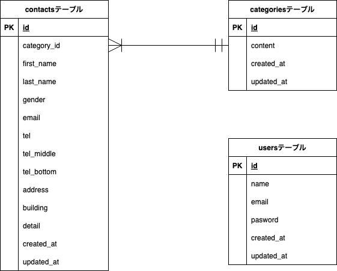

# お問い合わせフォーム

プロジェクト名：contact-form-ability-test

## 環境構築

Dockerビルド

1. git clone <git@github.com>:TakaharaYuichiro/contact-form-ability-test.git
2. docker-compose up -d --build
※ MySQLは、OSによって起動しない場合があるのでそれぞれのPCに合わせてdocker-compose.ymlファイルを編集してください。

Laravel環境構築

1. docker-compose exec php bash
2. composer install
3. .env.exampleファイルから.envを作成し、環境変数を変更
4. php artisan key:generate
5. php artisan migrate
6. php artisan db:seed

## 使用技術(実行環境)

- PHP 8.3.10
- Laravel 8.83.8
- MySQL 8.0.26

## ER図

## URL

- 開発環境：<http://localhost/>
- phpMyAdmin：<http://localhost:8080>

## 補足(出題内容から変更した点)

- ルールの項に「教材内の言語で開発」とあるため、javascriptの使用は不可と捉えました。しかしながら、管理画面における「詳細の表示はモーダルウィンドウを使用」に対して、教材内の言語でうまく実現できなかったため、javascriptを使用しました。
- contactsテーブルの仕様書においては、電話番号に関するカラムは「tell」ひとつとなっています。一方、お問い合わせフォームの入力画面の画面イメージにおいては、電話番号の入力に3つの入力ボックスが使用されています。このため、一つのカラムに統合せず、「tel」「tel_middle」「tel_bottom」の3つのカラムに分割しました。
- 登録ページの画面イメージにおいては、パスワードの確認欄がありませんが、教材内のサンプルに倣って、パスワードの確認欄を追加しました。
  